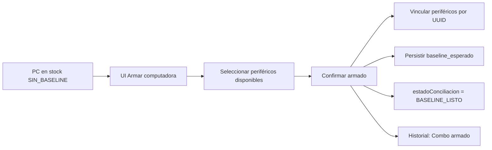

# Fase 1b — Armado de combo + baseline esperado

Plan de implementación detallado para la segunda subfase de trazabilidad stock ↔ agente.

**Fecha:** 2026-09-04  
**Estado:** Pendiente de aprobación  
**Documento padre:** [`trazabilidad-stock-agente.md`](./trazabilidad-stock-agente.md)  
**Prerequisito:** [`iteracion-fase1a-pasos.md`](./iteracion-fase1a-pasos.md) (implementada)  
**Alcance:** Backend Java + Frontend React  

---

## Objetivo

Permitir que IT **arme una computadora desde stock** vinculando periféricos ya cargados (monitor, mouse, teclado) a una PC por **UUID**, persista un **baseline esperado** y deje la PC en estado `BASELINE_LISTO` — lista para conciliación automática en Fase 2.

**Entregable:** flujo operativo stock → armado combo → baseline listo, sin matching ni bandeja aún.

---

## Estado actual relevante (post Fase 1a)

| Qué | Estado |
|-----|--------|
| `origenAlta`, `condicion`, `estadoConciliacion` | Implementados en modelo, API y UI |
| Alta PC en stock | `ComputadoraNueva.jsx` + modal en `PerifericoManualList.jsx` con tipo/condición |
| `ubicacion_stock` | Campo en `Computadora` + historial de estados; UI en asignaciones y stock |
| Periféricos manuales | CRUD + combos (`POST /api/perifericos-manuales/combo`) + asignación |
| Vinculación periférico → PC | Solo por `computadoraHostname` (string), **sin UUID** |
| `baseline_esperado` / `combo_esperado_id` | **No existen** |
| Badge conciliación en detalle | Solo lectura (`SIN_BASELINE`, `NO_APLICA`, etc.) |
| Tab "Computadoras en stock" | `PerifericoManualList.jsx` lista PCs `Sin Asignar`; sin acción "Armar" |
| Matching / bandeja / detectada por agente | Fuera de alcance — ver [`iteracion-fase2-pasos.md`](./iteracion-fase2-pasos.md) (Fase 2) |

---

## Flujo operativo objetivo (1b)



**Precondiciones para armar:**

- PC con `origenAlta = STOCK` (no `LEGACY` ni detectada por agente).
- `estadoConciliacion = SIN_BASELINE` (aún no armada).
- Estado operativo `Sin Asignar` (en stock).
- Periféricos candidatos en stock (`Sin Asignar`), sin asignar a otra PC.

**Política de periféricos (MVP):**

| Tipo | Obligatorio | Máximo |
|------|-------------|--------|
| Monitor | No | 1 |
| Mouse | No | 1 |
| Teclado | No | 1 |

Al menos **un periférico** o **datos manuales de HW** (CPU/RAM/disco) deben completarse para considerar el baseline válido.

---

## Observaciones técnicas

Decisiones de implementación acordadas para esta fase:

### 1. Split de lotes (`cantidad > 1`) y concurrencia

Al reutilizar la división de periféricos agrupados dentro de la transacción de armado, **no basta con leer + escribir en secuencia**: dos técnicos pueden tomar del mismo lote casi al mismo tiempo y provocar sobreasignación.

**Requisito:** el armado debe ejecutarse dentro de una **transacción Firestore** (`runTransaction`) que, por cada periférico con `cantidad > 1`:

1. Relea el documento dentro de la transacción.
2. Verifique `cantidad >= 1` y estado aún en stock (`Sin Asignar`).
3. Decrementa `cantidad` o crea el registro hijo asignado **en la misma transacción**.
4. Si la condición falla → abortar toda la transacción con **409 Conflict** (*"Periférico ya no disponible"*).

La actualización de la PC (`baseline_esperado`, `estado_conciliacion`, historial) debe formar parte de la **misma transacción** o, como mínimo, confirmarse solo si todos los splits/asignaciones succeeded (rollback lógico si alguno falla).

**Archivo sugerido:** helper `PerifericoManualRepository.decrementarCantidadEnTransaccion(...)` invocado desde `ArmadoComboService`.

### 2. Normalización de datos manuales de HW

Los campos opcionales `cpu_modelo`, `ram_total_gb` y `disco_resumen` se normalizan **al persistir el baseline** (no en UI), para facilitar el matching de Fase 2:

| Campo | Normalización al guardar |
|-------|--------------------------|
| `cpu_modelo` | `trim()` + minúsculas + colapsar espacios múltiples |
| `disco_resumen` | `trim()` + minúsculas + colapsar espacios |
| `ram_total_gb` | parse numérico; redondeo a entero si aplica; rechazar negativos |

Implementar en util dedicada, p. ej. `BaselineNormalizacionHelper.java`, invocada desde `ArmadoComboService` antes de armar el POJO.

**Nota:** la normalización es de **almacenamiento**; la UI puede seguir mostrando capitalización legible vía catálogos/labels.

### 3. Sin marcha atrás operativa (desarmar combo)

**Desarmar combo / re-armado queda explícitamente fuera de alcance en 1b.** Una vez confirmado el armado:

- `estadoConciliacion` pasa a `BASELINE_LISTO` (irreversible desde UI).
- Los periféricos quedan asignados a la PC.

Si un técnico elige el monitor incorrecto, **la corrección en 1b requiere intervención manual directa en Firestore** (o vía consola admin futura): revertir campos de PC y periféricos afectados. Documentar este procedimiento para el equipo IT.

**UX obligatoria en modal de armado:**

- Texto de confirmación explícito: *"Esta acción no se puede deshacer desde la aplicación."*
- Preview del combo antes del POST final.

---

## Modelo de datos

### Nuevo POJO `BaselineEsperado`

Objeto embebido en documento `computadoras`:

```text
baseline_esperado: {
  cpu_modelo          : string | null      # normalizado (trim + lowercase) al guardar
  ram_total_gb        : number | null      # entero >= 0
  disco_resumen       : string | null      # normalizado (trim + lowercase)
  perifericos         : [{
    tipo              : string             # monitor | mouse | teclado
    id_stock          : string             # ID PerifericoManual
    nombre            : string | null
    fabricante        : string | null
    numero_serie      : string | null      # opcional si IT lo cargó
  }]
  armado_at           : timestamp
  armado_por          : string | null      # usuario IT (si auth lo expone)
}
```

### Campos nuevos en `Computadora`

| Campo Java | Firestore key | Tipo |
|------------|---------------|------|
| `baselineEsperado` | `baseline_esperado` | `BaselineEsperado` (mapa) |
| `comboEsperadoId` | `combo_esperado_id` | `String` — UUID del combo lógico |

### Campo nuevo en `PerifericoManual`

| Campo Java | Firestore key | Tipo | Notas |
|------------|---------------|------|-------|
| `computadoraUuid` | `computadora_uuid` | `String` | **Nuevo.** Vinculación fuerte |
| `computadoraHostname` | `computadoraHostname` | `String` | **Mantener** por compatibilidad; rellenar en paralelo al armar |

---

## Cambios por capa

### 1. Backend — Modelo

**Archivos nuevos:**
- `inventario/src/main/java/com/bacarsa/inventario/models/BaselineEsperado.java`
- `inventario/src/main/java/com/bacarsa/inventario/models/BaselinePerifericoEsperado.java`

**Archivos a modificar:**
- `Computadora.java` — agregar `baselineEsperado`, `comboEsperadoId`
- `PerifericoManual.java` — agregar `computadoraUuid` con `@PropertyName("computadora_uuid")`

---

### 2. Backend — DTOs

| DTO | Cambio |
|-----|--------|
| `ComputadoraDTO` | Agregar `baselineEsperado`, `comboEsperadoId` |
| `ComputadoraListadoDTO` | Agregar `comboEsperadoId` (opcional: flag `tieneBaseline` derivado) |
| `PerifericoManualDTO` | Agregar `computadoraUuid` |
| **`ArmarComboDTO`** (nuevo) | Request: `monitorId`, `mouseId`, `tecladoId` (opcionales), `cpuModelo`, `ramTotalGb`, `discoResumen`, `motivo` |
| **`BaselineEsperadoDTO`** (nuevo) | Mirror del POJO para API |

**Validaciones en `ArmarComboDTO`:**

- IDs de periféricos distintos entre sí.
- No repetir tipo (máx. 1 monitor, 1 mouse, 1 teclado).
- Al menos un periférico **o** un campo manual de HW no vacío.

---

### 3. Backend — Mappers

| Mapper | Cambio |
|--------|--------|
| `ComputadoraMapper` | Mapear `baselineEsperado`, `comboEsperadoId` |
| `ComputadoraListadoMapper` | Leer `combo_esperado_id`; opcionalmente `baseline_esperado` mínimo para badge |
| `PerifericoManualMapper` | Mapear `computadoraUuid` |

**Agregar a `ComputadoraListadoFields.ALL`:** `"combo_esperado_id"` (no incluir `baseline_esperado` completo en listado liviano).

---

### 4. Backend — Service `ArmadoComboService` (nuevo)

**Método principal:** `armarCombo(String computadoraUuid, ArmarComboDTO dto)`

**Lógica (transacción Firestore obligatoria — ver [Observaciones técnicas](#observaciones-técnicas)):**

1. Cargar PC; validar precondiciones (`STOCK`, `SIN_BASELINE`, `Sin Asignar`).
2. **Iniciar `runTransaction`** que incluya PC + todos los periféricos involucrados.
3. Por cada ID de periférico (releído dentro de la transacción):
   - Verificar que existe, está en stock (`Sin Asignar`), `cantidad >= 1`.
   - Verificar tipo coincide (monitor/mouse/teclado).
   - Si `cantidad > 1`: decrementar en transacción + crear registro hijo asignado; si `cantidad == 1`: asignar documento existente.
   - Setear `computadoraUuid`, `computadoraHostname`, `comboId`.
4. Normalizar campos manuales HW (`BaselineNormalizacionHelper`) y construir `BaselineEsperado`.
5. Generar `comboEsperadoId = UUID.randomUUID()`.
6. Actualizar PC en la misma transacción:
   - `baselineEsperado`, `comboEsperadoId`
   - `estadoConciliacion = BASELINE_LISTO`
   - Entrada historial *"Combo armado"*
7. Commit; retornar `ComputadoraDTO` actualizado.
8. Si cualquier paso falla por concurrencia → **409** sin efectos parciales visibles.

**Idempotencia / re-armado:**

- Si PC ya tiene `BASELINE_LISTO` → **409 Conflict** salvo flag explícito `forzar: true` (fase posterior) o endpoint separado `POST .../rearmar-combo`.
- MVP: **no permitir re-armado**; solo mensaje claro en UI.

**Archivos:**
- `ArmadoComboService.java` (nuevo)
- `BaselineNormalizacionHelper.java` (nuevo)
- Refactor mínimo en `PerifericoManualService` / `PerifericoManualRepository` → operaciones de split **transaccionales** (`asignarAPcEnTransaccion(...)`)

---

### 5. Backend — Controller

**`POST /api/computadoras/{uuid}/armar-combo`**

- Body: `ArmarComboDTO`
- Respuesta: `ComputadoraDTO` con baseline y `estadoConciliacion = BASELINE_LISTO`
- Errores: 400 (validación), 404 (PC/periférico), 409 (ya armada o periférico no disponible)

**`GET /api/computadoras/{uuid}/perifericos-stock-disponibles`** (opcional, recomendado)

- Query: `?tipos=monitor,mouse,teclado`
- Devuelve periféricos en stock filtrados para poblar selects del modal sin traer toda la colección al cliente.

**Archivo:** `ComputadoraController.java` (o `ArmadoComboController.java` si se prefiere separar)

---

### 6. Backend — Consulta de periféricos por PC

Extender `PerifericoManualRepository` / service:

- `findByComputadoraUuid(String uuid)` — listar periféricos vinculados a una PC.
- Mantener búsqueda por hostname como fallback para datos legacy.

---

### 7. Frontend — API

**Archivo:** `inventario/inventario-front/src/api/computadoraApi.js`

```js
export async function armarCombo(uuid, body) { ... }
export async function fetchPerifericosStockDisponibles(uuid, tipos) { ... }  // si endpoint dedicado
```

---

### 8. Frontend — Modal "Armar computadora"

**Ubicación principal:** `ComputadoraDetail.jsx` — botón visible cuando:

- `origenAlta === 'STOCK'`
- `estadoConciliacion === 'SIN_BASELINE'`
- `estadoActual === 'Sin Asignar'`

**Ubicación secundaria:** `PerifericoManualList.jsx` — acción "Armar" en fila de PC en stock (mismo modal reutilizable).

**Componente sugerido:** `components/ArmarComboModal.jsx`

Contenido del modal:

- Resumen de la PC (hostname, tipo, condición, ubicación stock).
- 3 selects (FriendlySelect) poblados con periféricos en stock por tipo.
- Campos opcionales: CPU esperada, RAM (GB), disco (texto libre).
- Preview del combo antes de confirmar.
- **Aviso de irreversibilidad:** *"Esta acción no se puede deshacer desde la aplicación."* (ver [§3 Sin marcha atrás](#3-sin-marcha-atrás-operativa-desarmar-combo)).
- POST a `armar-combo` → refrescar detalle + listado context.

**Archivos:**
- `components/ArmarComboModal.jsx` (nuevo)
- `ComputadoraDetail.jsx`
- `PerifericoManualList.jsx`

---

### 9. Frontend — Bloque baseline en detalle (solo lectura)

En `ComputadoraDetail.jsx`, tab Inventario / Asignación:

- Si `baselineEsperado` presente:
  - Listar periféricos del combo con links a ficha de stock.
  - Mostrar CPU/RAM/disco declarados.
  - Fecha de armado.
- Badge `BASELINE_LISTO` ya mapeado en `ESTADO_CONCILIACION_MAP` — debe activarse post-armado.

**No incluir** comparación con datos del agente (Fase 3).

---

### 10. Frontend — Listados y filtros

**`ComputadoraList.jsx`:**

- Filtro opcional: `estadoConciliacion` → `SIN_BASELINE` | `BASELINE_LISTO` (solo PCs STOCK).
- Badge o ícono compacto si tiene baseline.

**`PerifericoManualList.jsx` (tab stock PCs):**

- Columna o badge: baseline pendiente / listo.
- Botón "Armar" cuando aplique.

---

### 11. Frontend — Asignación de periféricos (refactor mínimo)

Actualizar flujos que asignan por hostname para **preferir UUID** cuando esté disponible:

- `PerifericoManualDetail.jsx` — selector de PC por UUID (autocomplete hostname → uuid).
- Mantener compatibilidad: si solo hay hostname legacy, seguir funcionando.

**Fuera de alcance 1b:** migración masiva hostname → UUID en periféricos ya asignados.

---

## Orden de ejecución

| Paso | Tarea | Depende de |
|------|-------|------------|
| 1 | Backend: POJOs `BaselineEsperado` + campos en `Computadora` / `PerifericoManual` | — |
| 2 | Backend: DTOs + mappers + `ComputadoraListadoFields` | Paso 1 |
| 3 | Backend: refactor split/asignación → operaciones transaccionales + UUID | Paso 1 |
| 4 | Backend: `BaselineNormalizacionHelper` + `ArmadoComboService` + endpoint | Pasos 2, 3 |
| 5 | Backend: endpoint periféricos stock disponibles (opcional) | Paso 3 |
| 6 | Frontend: API + `ArmarComboModal` | Paso 4 |
| 7 | Frontend: integrar modal en detalle y tab stock | Paso 6 |
| 8 | Frontend: bloque baseline read-only en detalle | Paso 4 |
| 9 | Frontend: filtros/badges en listados | Paso 2 |
| 10 | Piloto con 2–3 PCs reales en dev + ajustes UX | Todos |

---

## Fuera de alcance (Fase 1b)

| Ítem | Fase |
|------|------|
| Matching automático al primer reporte del agente | 2 |
| Bandeja "Conciliaciones pendientes" | 2 |
| Job async, índices Firestore, retry | 2 |
| Alta `DETECTADA_POR_AGENTE` | 3 |
| Vinculación retroactiva | 3 |
| Bloque "esperado vs real" comparativo | 3 |
| Resolución de discrepancias | 4 |
| Re-armado / **desarmar combo** (corrección desde UI) | Backlog (post-piloto); en 1b → corrección manual en Firestore |
| Migración masiva periféricos hostname → UUID | Backlog |
| Acción "Completar datos legacy" → baseline manual | Backlog / extensión 1b |

---

## Criterios de aceptación (Fase 1b)

- [ ] Desde detalle de PC en stock (`SIN_BASELINE`), puedo abrir "Armar computadora".
- [ ] Puedo elegir monitor/mouse/teclado del stock disponible (máx. 1 por tipo).
- [ ] Puedo declarar CPU/RAM/disco esperados opcionalmente.
- [ ] Al confirmar, periféricos quedan vinculados por `computadoraUuid` (y hostname).
- [ ] La PC persiste `baseline_esperado` y `combo_esperado_id`.
- [ ] `estadoConciliacion` pasa a `BASELINE_LISTO`.
- [ ] Historial de la PC registra el armado del combo.
- [ ] Detalle muestra el baseline armado (solo lectura).
- [ ] No puedo armar una PC ya en `BASELINE_LISTO` sin error claro.
- [ ] No puedo usar un periférico ya asignado a otra PC.
- [ ] Listado permite distinguir PCs con/sin baseline.
- [ ] PCs `LEGACY` / `NO_APLICA` no muestran flujo de armado.
- [ ] Modal advierte que el armado **no es reversible** desde la app.
- [ ] Dos armados concurrentes sobre el mismo lote (`cantidad > 1`) → uno falla con 409, sin sobreasignación.
- [ ] `cpu_modelo` y `disco_resumen` persistidos normalizados (trim + lowercase).

---

## Riesgos y mitigaciones

| Riesgo | Mitigación |
|--------|------------|
| **Condición de carrera** en split (`cantidad > 1`) si dos técnicos arman a la vez | Transacción Firestore atómica; releer + validar cantidad dentro de la tx; 409 si ya no disponible |
| Periféricos con `cantidad > 1` al armar | Split transaccional (no reutilizar `asignar()` fuera de tx sin adaptar) |
| Hostname cambia después del armado | UUID como clave canónica; hostname como dato derivado |
| Baseline incompleto (sin HW manual ni periféricos) | Validación mínima en service |
| **Error humano al elegir periférico** (monitor equivocado) | Aviso de irreversibilidad en UI; corrección manual en Firestore en 1b; desarmar en backlog |
| Strings HW inconsistentes dificultan matching Fase 2 | `BaselineNormalizacionHelper` al persistir |
| UX confusa entre "asignar periférico" suelto vs "armar combo" | Botón dedicado + copy claro; armado agrupa la operación |
| Pilotear antes de Fase 2 | Probar con lote chico real antes de implementar matching |

---

## Verificación manual sugerida

> Guía operativa completa del piloto: [`piloto-fase1b.md`](./piloto-fase1b.md)

1. Crear PC en stock + 3 periféricos en stock (monitor, mouse, teclado).
2. Armar combo desde detalle → verificar Firestore: `baseline_esperado`, `combo_esperado_id`, periféricos con `computadora_uuid`.
3. Confirmar badge `Baseline listo` en detalle y filtro en listado.
4. Intentar armar de nuevo → error 409.
5. Intentar usar periférico ya asignado en otra PC → error 409/400.
6. PC legacy → no debe ofrecer armado.
7. **Concurrencia:** dos POST simultáneos sobre el mismo periférico lote → uno 200, uno 409.
8. Verificar en Firestore que `cpu_modelo` / `disco_resumen` quedaron en minúsculas normalizadas.

### Procedimiento manual de corrección (solo 1b)

Si se armó con periférico incorrecto, hasta que exista "desarmar combo":

1. Identificar PC (`computadoras/{uuid}`) y periféricos vinculados (`computadora_uuid`).
2. Revertir periférico(s): quitar `computadora_uuid`, `computadoraHostname`, `comboId`; restaurar estado `Sin Asignar`.
3. En la PC: borrar `baseline_esperado`, `combo_esperado_id`; setear `estado_conciliacion = SIN_BASELINE`.
4. Opcional: entrada manual en historial explicando la corrección.

Documentar casos reales del piloto para diseñar el endpoint de desarmar en backlog.

---

## Referencias

- Diseño macro: [`trazabilidad-stock-agente.md`](./trazabilidad-stock-agente.md) — RF-02, modelo `baseline_esperado`, Fase 1b
- Fase anterior: [`iteracion-fase1a-pasos.md`](./iteracion-fase1a-pasos.md)
- Periféricos manuales: `PerifericoManualService.java`, `PerifericoManualList.jsx`
- Stock PCs: tab en `PerifericoManualList.jsx`, `ComputadoraAsignaciones.jsx`
