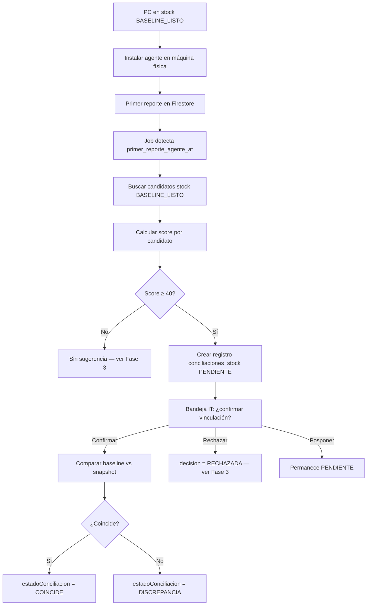

# Fase 2 — Conciliación stock ↔ agente (matching + bandeja)

Plan de implementación detallado para la tercera subfase de trazabilidad stock ↔ agente.

**Fecha:** 2026-09-04  
**Estado:** Implementada (pendiente piloto Fase 2 en dev)  
**Documento padre:** [`trazabilidad-stock-agente.md`](./trazabilidad-stock-agente.md)  
**Prerequisitos:**
- [`iteracion-fase1a-pasos.md`](./iteracion-fase1a-pasos.md) — implementada
- [`iteracion-fase1b-pasos.md`](./iteracion-fase1b-pasos.md) — implementada
- [`piloto-fase1b.md`](./piloto-fase1b.md) — **aprobado en dev** (bloqueante recomendado antes de prod)

**Alcance:** Backend Java + Frontend React + índices Firestore

---

## Objetivo

Cuando CyberWatch reporta por **primera vez** el hardware de una máquina física, el sistema debe:

1. **Detectar** candidatos en stock con `BASELINE_LISTO`.
2. **Calcular score** de coincidencia (hardware + combo).
3. **Crear sugerencia** en bandeja IT con confirmación humana (*"¿esto = esto?"*).
4. Tras confirmación, **conciliar** baseline vs snapshot del agente → `COINCIDE` o `DISCREPANCIA`.

**Entregable:** flujo de notificación y confirmación operativo, **sin degradar** performance de listados (matching 100% async).

**No incluye en esta fase:** alta automática `DETECTADA_POR_AGENTE`, vinculación retroactiva, bloque comparativo permanente en detalle, resolución formal de discrepancias ni KPIs (Fases 3–4).

---

## Estado actual relevante (post Fase 1b)

| Qué | Estado |
|-----|--------|
| Alta stock + tipo/condición/origen | ✅ Fase 1a |
| Armado combo + `baseline_esperado` | ✅ Fase 1b |
| `estadoConciliacion = BASELINE_LISTO` post-armado | ✅ |
| `ultima_sincronizacion` del agente en `Computadora` | ✅ (campo existente; lo escribe el agente C# en Firestore) |
| `primer_reporte_agente_at` | ❌ No existe |
| `matching_job_estado` | ❌ No existe |
| `score_conciliacion` / `fecha_conciliacion` | ❌ No existen en modelo |
| Colección `conciliaciones_stock` | ❌ No existe |
| Servicio / job de matching | ❌ No existe |
| Bandeja `/conciliaciones` | ❌ No existe |
| Índices Firestore para matching | ❌ No en `firestore.indexes.json` |
| Tolerancia RAM / match parcial periféricos | ❌ Solo diseñado en doc macro |
| `BaselineNormalizacionHelper` | ✅ Reutilizable para comparación |

### Problema de identidad (decisión pendiente)

Hoy:

- PC en stock se crea con **UUID aleatorio** (`ComputadoraService.crear()`).
- El agente escribe en Firestore con el **UUID de máquina** del agente (documento distinto salvo coincidencia).

**Antes de implementar**, acordar estrategia de merge al confirmar vinculación:

| Opción | Descripción | Pros | Contras |
|--------|-------------|------|---------|
| **A — Stock canónico** | Mantener doc stock; copiar/mergear snapshot agente al doc stock; registrar UUID agente en campo auxiliar | Historial stock intacto | Dos docs temporales hasta confirmar |
| **B — Agente canónico** | Tras confirmar, migrar baseline al doc del agente; marcar doc stock como fusionado/obsoleto | UUID agente = doc real | Merge más complejo; riesgo perder refs |
| **C — Pre-vinculación por hostname** | Política operativa: hostname stock = hostname futuro de la PC | Match trivial | Frágil; hostname cambia |

**Recomendación MVP:** **Opción A** — el documento de stock (con baseline e historial) es el canónico; al confirmar se enriquece con datos del agente y se guarda `agente_uuid` / referencia al doc agente si difiere.

### Reglas de merge al confirmar (identificadores fuertes)

Al confirmar la vinculación, el merge agente → stock debe ser **explícito en código** (`ConciliacionMergeHelper` o equivalente). Separar tres categorías:

| Categoría | Campos | Regla |
|-----------|--------|-------|
| **Solo comparación** (nunca sobrescribir en merge) | `baseline_esperado`, `combo_esperado_id`, `origen_alta`, historial stock, `tipo_equipo`/`condicion` declarados por IT | Usados únicamente para score y `COINCIDE`/`DISCREPANCIA`; **inmutables** en merge |
| **Identidad fuerte — rellenar si vacío** | `serial_equipo`, `motherboard_serial`, `bios_uuid`, `mac_principal`, `asset_tag` | Si el campo en stock es `null`/vacío **y** el agente trae valor válido → **escribir**. Si stock ya tiene valor → **no sobrescribir**; si difieren → registrar en `campos_diferentes` / discrepancia |
| **Telemetría viva — siempre desde agente post-confirmación** | `ultima_sincronizacion`, `ram_total_gb`, `procesador`/`procesador_detallado`, `discos`, `modulos_ram`, `perifericos` (snapshot agente), `estado_conexion`, `sistema_operativo` | Tras confirmación, copiar/mergear snapshot agente al doc stock; son datos operativos del agente |
| **Referencia cruzada** | `agente_uuid` | Setear siempre al UUID del documento agente fuente |

**Validación pre-merge:**

- Rechazar valores identidad fuerte **genéricos o inválidos** del agente (misma lista que seriales de monitor: `00000000`, `Default string`, etc.) — no rellenar con basura.
- Si stock y agente tienen el mismo identificador fuerte con valores distintos → **no mergear silenciosamente**; marcar discrepancia y dejar ambos visibles en `detalle_comparacion`.
- Log de merge: campos escritos, campos omitidos (ya poblados), campos en conflicto.

---

## Flujo operativo objetivo (Fase 2)



---

## Requerimientos funcionales (alcance Fase 2)

Derivados de RF-04, RF-05, RF-06 y RF-10 parcial del documento macro.

### RF-2.01 — Detección del primer reporte

- Detectar cuando un documento recibe **`ultima_sincronizacion`** por primera vez (o cambia de null → valor).
- Persistir `primer_reporte_agente_at` en el documento agente (y/o en sugerencia).
- Encolar job de matching con `matching_job_estado = MATCHING_PENDIENTE`.
- **No** ejecutar matching en endpoints de listado/detalle.

### RF-2.02 — Búsqueda de candidatos stock

- Candidatos: PCs con `origen_alta = STOCK` AND `estado_conciliacion = BASELINE_LISTO`.
- Pre-filtro Firestore por estado (índice compuesto); score en memoria sobre ventana acotada (ej. últimos 90 días / ubicación).
- Excluir `LEGACY` y `NO_APLICA`.

### RF-2.03 — Cálculo de score

Implementar pesos y umbrales del doc macro:

| Campo | Peso | Notas |
|-------|------|-------|
| Serial equipo / asset tag | +50 | Si ambos lados lo tienen |
| Motherboard serial / BIOS UUID | +30 | |
| MAC principal | +20 | |
| Modelo CPU | +15 | Normalizar (reutilizar helper) |
| RAM total (GB) | +10 | Con tolerancia OS |
| Serial monitor (combo) | +10 | Serial no genérico |
| Marca/modelo monitor | +5 | Fallback si serial ausente |

| Score | Acción |
|-------|--------|
| ≥ 70 | Sugerencia alta confianza |
| 40–69 | Sugerencia revisión manual |
| < 40 | No crear sugerencia (Fase 3: detectada por agente) |

- Hostname **no** es criterio principal.
- Empate → lista ordenada por score en bandeja.

### RF-2.04 — Tolerancia RAM (matching y conciliación)

Reutilizar reglas del doc macro:

- Tolerancia relativa 5% + absoluta 0.5 GB.
- Buckets nominales (4 / 8 / 16 / 32 GB).
- `15.8 GB` vs stock `16 GB` → match (+10), **no** discrepancia.
- `8 GB` vs `16 GB` → no match en score; si IT confirma igual → `DISCREPANCIA`.

### RF-2.05 — Match parcial de periféricos

- Serial genérico (`00000000`, `Default string`, etc.) → tratar como ausente.
- Cascada: serial exacto → marca/modelo → solo tipo presente.
- UI de sugerencia: indicar *"Match por marca/modelo (serial no disponible en agente)"*.

### RF-2.06 — Colección `conciliaciones_stock`

Registro **append-only** por intento:

```text
id                          : string (auto)
agente_uuid                 : string          # doc que reportó el agente
candidato_stock_uuid        : string          # PC stock BASELINE_LISTO
score                       : number (0-100)
campos_coincidentes         : string[]
campos_diferentes           : string[]
decision                    : PENDIENTE | CONFIRMADA | RECHAZADA | POSPUESTA
usuario                     : string | null
fecha                       : timestamp
origen                      : PRIMER_REPORTE
snapshot_clave              : string          # idempotencia: hash o ultima_sincronizacion
detalle_comparacion         : map (opcional)  # resultado campo a campo post-confirmación
```

### RF-2.07 — Bandeja de conciliaciones pendientes

Nueva ruta: `/conciliaciones` (o sub-sección en sidebar IT).

Listar (paginado):

| Vista | Filtro |
|-------|--------|
| Sugerencias pendientes | `decision = PENDIENTE` |
| Stock sin agente | `origen_alta = STOCK` AND `estado_conciliacion = BASELINE_LISTO` AND sin `ultima_sincronizacion` |
| Errores de matching | `matching_job_estado = MATCHING_ERROR` |

**Excluir legacy por defecto** (`origen_alta != LEGACY`).

Cada fila pendiente muestra:

- Lado **agente:** hostname, CPU, RAM, monitor detectado.
- Lado **stock:** hostname stock, tipo, condición, baseline resumido.
- Score + campos que coincidieron.
- Acciones: **Confirmar** | **Rechazar** | **Posponer**.

### RF-2.08 — Confirmación de vinculación

Al **Confirmar**:

1. Validar sugerencia `PENDIENTE` y permisos IT.
2. **Merge controlado** snapshot agente → doc stock canónico (reglas en [Reglas de merge](#reglas-de-merge-al-confirmar-identificadores-fuertes)).
3. Comparar `baseline_esperado` vs snapshot agente campo a campo.
4. Setear en PC stock:
   - `estadoConciliacion = COINCIDE | DISCREPANCIA`
   - `score_conciliacion`, `fecha_conciliacion`
   - `estadoConciliacion` deja de ser `BASELINE_LISTO` / `PENDIENTE`
5. Actualizar sugerencia: `decision = CONFIRMADA`, usuario, fecha.
6. Historial PC: *"Validada con stock — coincide"* o *"Discrepancia detectada"*.

> **Crítico:** implementar merge en helper dedicado con tests unitarios por categoría de campo (rellenar vacío vs comparar vs telemetría viva).

Al **Rechazar**:

- `decision = RECHAZADA` (append-only; no borrar).
- No modificar baseline stock.
- Comportamiento post-rechazo para el doc agente → **Fase 3** (`DETECTADA_POR_AGENTE`).

Al **Posponer**:

- Permanece `PENDIENTE`; registrar `pospuesto_at` opcional.

### RF-2.09 — Resiliencia del job (RNF-04, RNF-09)

**Estados `matching_job_estado` por documento:**

| Estado | Significado |
|--------|-------------|
| `MATCHING_PENDIENTE` | Primer reporte detectado; job no corrió |
| `MATCHING_EN_PROCESO` | Bloqueo optimista; evita doble dispatch |
| `MATCHING_OK` | Sugerencia creada o descartada sin candidatos |
| `MATCHING_ERROR` | Falló; pendiente retry |

**Timeout de bloqueos huérfanos (`MATCHING_EN_PROCESO`):**

`MATCHING_EN_PROCESO` actúa como lock. Si el proceso falla silenciosamente o el servidor se reinicia en ese punto, el documento puede quedar **trabado**.

Mitigación obligatoria:

1. Al pasar a `MATCHING_EN_PROCESO`, persistir **`matching_en_proceso_at`** (timestamp).
2. El cron de recuperación (cada 15–30 min) debe buscar docs con:
   - `matching_job_estado = MATCHING_EN_PROCESO`
   - `matching_en_proceso_at` **anterior a** umbral configurable (default **15 min**)
3. Para cada lock expirado:
   - Log de alerta: *"Lock huérfano liberado"* + uuid + antigüedad.
   - Resetear a `MATCHING_PENDIENTE` (reintento) o `MATCHING_ERROR` si superó reintentos.
   - **Nunca** dejar `EN_PROCESO` indefinidamente.
4. Métrica/monitoreo: contador `matching_locks_orphans_released` (ver [Puntos a monitorear](#puntos-a-monitorear)).

**Idempotencia:**

- Clave: `(agente_uuid, snapshot_clave)` donde `snapshot_clave = ultima_sincronizacion` o hash de hardware.
- No duplicar sugerencias si ya existe una `PENDIENTE` o `CONFIRMADA` para la misma clave.

**Retry:**

- Backoff: 1 min → 5 min → 30 min → 2 h (máx. 5 intentos).
- Cron recuperación cada 15–30 min para docs en `MATCHING_PENDIENTE` / `MATCHING_ERROR`.
- Admin: `POST /api/admin/conciliaciones/reprocesar/{uuid}`.

**Observabilidad:**

- Log estructurado: uuid, score, candidatos evaluados, duración, intento N.

### RF-2.10 — Rendimiento de bandeja y candidatos

**Ventana temporal 90 días (obligatoria en MVP):**

| Consulta | Pre-filtro |
|----------|------------|
| Candidatos stock para score | Solo PCs `BASELINE_LISTO` con `baseline_esperado.armado_at` ≥ now − 90 días (o filtro equivalente por fecha armado) |
| Bandeja sugerencias `PENDIENTE` | Default: `fecha` ≥ now − 90 días; toggle admin *"Ver histórico completo"* para auditoría |
| Stock sin agente | Misma ventana sobre fecha armado |

Los índices compuestos propuestos son correctos para el MVP, pero **`conciliaciones_stock` crecerá** (miles de registros append-only). Sin ventana temporal, las queries de bandeja degradarán aunque existan índices.

**Buenas prácticas adicionales:**

- Paginación obligatoria (`limit` default 25–50) en `GET /api/conciliaciones`.
- Count de pendientes para badge sidebar: query separada solo `decision=PENDIENTE` + ventana 90 días (no traer documentos completos).
- Archivado / TTL de registros `CONFIRMADA`/`RECHAZADA` > 1 año → **backlog Fase 4**; documentar umbral antes de prod.

---

## Modelo de datos — cambios Fase 2

### Campos nuevos en `Computadora`

| Campo Java | Firestore key | Tipo | Notas |
|------------|---------------|------|-------|
| `primerReporteAgenteAt` | `primer_reporte_agente_at` | Timestamp | Set al detectar primer sync |
| `matchingJobEstado` | `matching_job_estado` | enum String | Ver tabla arriba |
| `scoreConciliacion` | `score_conciliacion` | Integer | 0–100, post-confirmación |
| `fechaConciliacion` | `fecha_conciliacion` | Timestamp | Post-confirmación |
| `agenteUuid` | `agente_uuid` | String | Opcional; si doc agente ≠ doc stock |
| `matchingEnProcesoAt` | `matching_en_proceso_at` | Timestamp | Set al entrar en `MATCHING_EN_PROCESO`; usado por timeout de lock huérfano |

**Enum nuevo:** `MatchingJobEstado` — `MATCHING_PENDIENTE`, `MATCHING_EN_PROCESO`, `MATCHING_OK`, `MATCHING_ERROR`.

**Enum nuevo (sugerencia):** `DecisionConciliacion` — `PENDIENTE`, `CONFIRMADA`, `RECHAZADA`, `POSPUESTA`.

**Transición de estados conciliación en Fase 2:**

```text
BASELINE_LISTO  →  (job crea sugerencia)  →  PENDIENTE  →  COINCIDE | DISCREPANCIA
                                              ↘ RECHAZADA (solo en conciliaciones_stock; PC stock sigue BASELINE_LISTO)
```

> **Nota:** usar `EstadoConciliacion.PENDIENTE` en la PC stock cuando hay sugerencia activa, o mantener `BASELINE_LISTO` + flag en sugerencia — **definir en implementación** (preferir `PENDIENTE` en PC para filtros de bandeja).

### Colección nueva `conciliaciones_stock`

Ver RF-2.06. Configurar nombre en `application.properties`:

```properties
firebase.collection.conciliaciones_stock=conciliaciones_stock
```

---

## Índices Firestore (obligatorio antes de prod)

Agregar a `inventario/firestore.indexes.json` y desplegar **antes** de activar matching:

**Colección `computadoras`:**

```text
# Candidatos stock con baseline listo
origen_alta ASC, estado_conciliacion ASC, estado_actual.nombre ASC

# Bandeja / monitoreo
estado_conciliacion ASC, primer_reporte_agente_at DESC

# Stock sin agente (alertas)
origen_alta ASC, estado_conciliacion ASC, ultima_sincronizacion ASC
```

**Colección `conciliaciones_stock`:**

```text
decision ASC, fecha DESC
agente_uuid ASC, fecha DESC
candidato_stock_uuid ASC, decision ASC
```

---

## Cambios por capa

### 1. Backend — Modelo

**Archivos nuevos:**

- `models/MatchingJobEstado.java`
- `models/DecisionConciliacion.java`
- `models/ConciliacionStock.java` (entidad colección)
- `models/OrigenConciliacion.java` — `PRIMER_REPORTE`, `RETROACTIVA` (esta última para Fase 3)

**Archivos a modificar:**

- `Computadora.java` — campos listados arriba
- `EstadoConciliacion.java` — documentar uso de `PENDIENTE` en Fase 2 (ya existe)

---

### 2. Backend — DTOs

| DTO | Cambio |
|-----|--------|
| `ComputadoraDTO` | `primerReporteAgenteAt`, `matchingJobEstado`, `scoreConciliacion`, `fechaConciliacion`, `agenteUuid` |
| `ComputadoraListadoDTO` | `matchingJobEstado`, flag `tieneSugerenciaPendiente` (derivado o denormalizado) |
| **`ConciliacionStockDTO`** (nuevo) | Mirror entidad para API |
| **`ConciliacionStockListadoDTO`** (nuevo) | Versión liviana para bandeja |
| **`ConfirmarConciliacionDTO`** (nuevo) | Request confirmación: `sugerenciaId`, `motivo` opcional |
| **`RechazarConciliacionDTO`** (nuevo) | Request rechazo: `sugerenciaId`, `motivo` |

---

### 3. Backend — Utilidades de matching

**Archivos nuevos:**

- `util/MatchingScoreHelper.java` — pesos, umbrales, score total
- `util/RamToleranciaHelper.java` — buckets y tolerancia 5% / 0.5 GB
- `util/SerialPerifericoHelper.java` — detectar seriales genéricos
- `util/HardwareNormalizacionHelper.java` — extender `BaselineNormalizacionHelper` para CPU agente vs baseline
- `util/ConciliacionComparador.java` — baseline vs snapshot → `COINCIDE` / `DISCREPANCIA` + detalle
- **`util/ConciliacionMergeHelper.java`** — merge agente → stock con reglas por categoría de campo (tests obligatorios)

---

### 4. Backend — Repository

**Archivo nuevo:** `repository/ConciliacionStockRepository.java`

- `findPendientes(limit, offset)`
- `findByAgenteUuidAndSnapshotClave(uuid, clave)` — idempotencia
- `save(...)`

**Modificar:** `ComputadoraRepository.java`

- `findCandidatosStockBaselineListo(ventanaDias)` — query indexada
- `findStockSinAgente(...)` — para vista bandeja
- `findMatchingPendientes(...)` — cron recuperación

---

### 5. Backend — Services

**Archivos nuevos:**

| Service | Responsabilidad |
|---------|-----------------|
| `MatchingStockService` | Orquesta detección, candidatos, score, creación sugerencia |
| `ConciliacionStockService` | CRUD sugerencias, confirmar/rechazar/posponer |
| `ConciliacionComparacionService` | Post-confirmación: comparar y persistir resultado |
| `MatchingJobScheduler` | Cron detección + retry + recuperación |
| `MatchingDeteccionService` | Detecta primer reporte; setea `primer_reporte_agente_at` |

**Flujo `MatchingStockService.ejecutarMatching(agenteUuid)`:**

1. Cargar doc agente; validar hardware mínimo presente.
2. Set `matching_job_estado = EN_PROCESO` (transacción optimista).
3. Buscar candidatos stock `BASELINE_LISTO`.
4. Calcular score por candidato; quedarse con top N (ej. 3).
5. Si mejor score ≥ 40 → crear `conciliaciones_stock` PENDIENTE.
6. Actualizar PC stock candidata → `estado_conciliacion = PENDIENTE` (si aplica).
7. Set `matching_job_estado = OK` en doc agente.

---

### 6. Backend — Controller

**Archivo nuevo:** `controller/ConciliacionStockController.java`

| Método | Ruta | Descripción |
|--------|------|-------------|
| GET | `/api/conciliaciones` | Bandeja paginada (`?decision=PENDIENTE`) |
| GET | `/api/conciliaciones/{id}` | Detalle sugerencia |
| POST | `/api/conciliaciones/{id}/confirmar` | Confirmar vinculación |
| POST | `/api/conciliaciones/{id}/rechazar` | Rechazar sugerencia |
| POST | `/api/conciliaciones/{id}/posponer` | Posponer |
| GET | `/api/conciliaciones/stock-sin-agente` | PCs baseline sin sync |
| POST | `/api/admin/conciliaciones/reprocesar/{uuid}` | Forzar re-run (admin) |

---

### 7. Backend — Scheduler

**Archivo nuevo:** `config/MatchingSchedulerConfig.java` o `@Scheduled` en service.

| Job | Frecuencia | Acción |
|-----|------------|--------|
| Detección primer reporte | 5 min | Docs con `ultima_sincronizacion` nueva y sin `primer_reporte_agente_at` |
| Procesamiento cola | 5 min | Docs con `MATCHING_PENDIENTE` |
| Recuperación errores | 30 min | `MATCHING_ERROR` con backoff **+ locks huérfanos** (`EN_PROCESO` > 15 min) |

> El agente C# **no se modifica** en Fase 2. El backend Java **observa** Firestore vía cron/listener.

---

### 8. Frontend — API

**Archivo nuevo:** `api/conciliacionApi.js`

```js
export async function fetchConciliaciones(params) { ... }
export async function fetchConciliacion(id) { ... }
export async function confirmarConciliacion(id, body) { ... }
export async function rechazarConciliacion(id, body) { ... }
export async function posponerConciliacion(id) { ... }
export async function fetchStockSinAgente(params) { ... }
```

---

### 9. Frontend — Bandeja

**Archivos nuevos:**

- `pages/ConciliacionesList.jsx` — listado principal con tabs/filtros
- `pages/ConciliacionDetail.jsx` — detalle sugerencia (opcional si modal alcanza)
- `components/ConciliacionSugerenciaCard.jsx` — card agente vs stock
- `components/ConciliacionConfirmModal.jsx` — confirmación con resumen diff

**Ruta en `App.jsx`:**

```jsx
<Route path="/conciliaciones" element={<ConciliacionesList />}>
  <Route path=":id" element={<ConciliacionDetail />} />
</Route>
```

**Sidebar:** entrada "Conciliaciones" con badge de pendientes (count query liviana).

**Notificación:** toast o badge sidebar al detectar nuevas sugerencias (polling 2–5 min o SSE futuro).

---

### 10. Frontend — Ajustes en pantallas existentes

| Pantalla | Cambio |
|----------|--------|
| `ComputadoraDetail.jsx` | Badge `PENDIENTE` / `COINCIDE` / `DISCREPANCIA`; link a sugerencia activa si existe |
| `ComputadoraList.jsx` | Filtro `estadoConciliacion` incluye `PENDIENTE`; columna score opcional |
| `Dashboard.jsx` | Widget opcional: N sugerencias pendientes |

**Fuera de alcance Fase 2 en detalle:** bloque completo "Esperado vs Real" (Fase 3). La bandeja sí muestra comparación lado a lado para decidir.

---

## Orden de ejecución

| Paso | Tarea | Depende de |
|------|-------|------------|
| 0 | **Aprobar estrategia merge UUID** (stock canónico vs agente) | — |
| 1 | Índices Firestore en `firestore.indexes.json` + deploy | — |
| 2 | Modelo + enums + DTOs + mappers (`Computadora`, `ConciliacionStock`) | — |
| 3 | Helpers matching (score, RAM, serial, normalización) | Paso 2 |
| 4 | `ConciliacionStockRepository` + queries candidatos | Paso 1, 2 |
| 5 | `MatchingDeteccionService` + scheduler detección | Paso 4 |
| 6 | `MatchingStockService` (score + crear sugerencia) | Paso 3, 5 |
| 7 | `ConciliacionStockService` confirmar/rechazar/posponer | Paso 6 |
| 8 | `ConciliacionComparacionService` (COINCIDE/DISCREPANCIA) | Paso 7 |
| 9 | Controller + endpoints admin reprocesar | Paso 7, 8 |
| 10 | Cron retry + recuperación | Paso 6 |
| 11 | Frontend API + bandeja + sidebar | Paso 9 |
| 12 | Ajustes badges en listado/detalle | Paso 11 |
| 13 | Piloto Fase 2 en dev (ver abajo) | Todos |

---

## Fuera de alcance (Fase 2)

| Ítem | Fase |
|------|------|
| Alta automática `DETECTADA_POR_AGENTE` | 3 |
| Vinculación retroactiva | 3 |
| Bloque permanente "Esperado vs Real" en detalle PC | 3 |
| Workflow resolución discrepancias (notas IT, enlace EventoHardware) | 4 |
| KPIs dashboard (% validadas, tiempo stock→agente) | 4 |
| Alertas PC en stock > N días sin agente (solo listado en bandeja en 2) | 4 |
| Auto-vinculación silenciosa score ≥ 90 | Backlog |
| QR forzado (+100 score) | Backlog |
| Cambios en agente C# CyberWatch | — |

---

## Criterios de aceptación (Fase 2)

### Matching y job

- [ ] Al primer reporte del agente (`ultima_sincronizacion` nueva), se setea `primer_reporte_agente_at`.
- [ ] El matching corre async; listados de PCs no se degradan mediblemente.
- [ ] PCs `BASELINE_LISTO` en stock son candidatas; `LEGACY` quedan excluidas.
- [ ] Score calculado con pesos acordados; umbrales 40 / 70 respetados.
- [ ] RAM 15.8 vs 16 GB suma puntos y no genera discrepancia.
- [ ] Monitor con serial genérico en agente puede matchear por marca/modelo con aviso.
- [ ] Reprocesar mismo snapshot no duplica sugerencias (idempotencia).
- [ ] Job fallido reintenta; tras agotar reintentos queda en `MATCHING_ERROR` visible en bandeja/admin.
- [ ] Lock `MATCHING_EN_PROCESO` huérfano se libera automáticamente tras timeout (default 15 min).
- [ ] Índices Firestore desplegados; queries no devuelven `FAILED_PRECONDITION`.
- [ ] Bandeja y candidatos usan pre-filtro **90 días** por defecto; paginación activa.

### Bandeja y confirmación

- [ ] Existe bandeja `/conciliaciones` con sugerencias `PENDIENTE`.
- [ ] Cada sugerencia muestra lado agente vs lado stock + score + campos coincidentes.
- [ ] Puedo **Confirmar**, **Rechazar** y **Posponer**.
- [ ] Al confirmar: `estadoConciliacion` pasa a `COINCIDE` o `DISCREPANCIA` según comparación.
- [ ] Se persisten `score_conciliacion` y `fecha_conciliacion`.
- [ ] Historial PC registra validación o discrepancia.
- [ ] Al rechazar: sugerencia queda `RECHAZADA`; baseline stock intacto.
- [ ] Vista "Stock sin agente" lista PCs `BASELINE_LISTO` sin sync.
- [ ] Merge al confirmar: identidad fuerte **solo rellena vacíos**; baseline **no se sobrescribe**.
- [ ] Conflicto en identidad fuerte (stock ≠ agente) genera discrepancia visible, no merge silencioso.

### UX

- [ ] Sidebar muestra badge con count de pendientes.
- [ ] Detalle PC refleja nuevo estado de conciliación post-confirmación.
- [ ] Mensaje explícito cuando match es por marca/modelo (serial no disponible).

---

## Piloto sugerido (post-implementación)

Antes de prod, repetir en dev con PCs del piloto 1b:

1. PC con baseline armado (Fase 1b) → instalar agente en máquina física (o simular doc agente en Firestore).
2. Esperar cron / forzar reproceso admin → aparece sugerencia en bandeja.
3. Confirmar → verificar `COINCIDE` si hardware coincide.
4. Segunda PC con RAM distinta en agente → confirmar → `DISCREPANCIA`.
5. Tercer reporte sin candidato (score < 40) → sin sugerencia (prep Fase 3).

Documentar resultados en `piloto-fase2.md` (crear al implementar).

---

## Puntos a monitorear

Aspectos críticos a vigilar en implementación, piloto y producción.

### 1. Bloqueos huérfanos (`MATCHING_EN_PROCESO`)

| Qué vigilar | Acción |
|-------------|--------|
| Docs en `EN_PROCESO` > 15 min | Cron de recuperación debe liberarlos automáticamente |
| Picos de `matching_locks_orphans_released` | Investigar crashes, timeouts de transacción o jobs colgados |
| Reintentos tras liberar lock | Verificar que no duplica sugerencias (idempotencia por `snapshot_clave`) |

**Prueba manual:** matar el proceso Java durante un matching en curso → confirmar que el cron libera el lock y reencola.

### 2. Rendimiento a escala

| Qué vigilar | Umbral orientativo | Acción |
|-------------|-------------------|--------|
| Latencia `GET /api/conciliaciones` | > 500 ms p95 | Revisar ventana 90 días, paginación, índices |
| Tamaño colección `conciliaciones_stock` | > 5 000 docs | Evaluar archivado; mantener bandeja en ventana acotada |
| Query candidatos stock | > 2 s | Reducir ventana; verificar índice compuesto desplegado |
| Count badge sidebar | > 200 ms | Query count-only, no full scan |

**Regla operativa:** no desactivar el pre-filtro de 90 días en bandeja/candidatos sin revisar performance.

### 3. Sobrescritura de datos en merge

| Qué vigilar | Acción |
|-------------|--------|
| Identidad fuerte escrita sobre valor stock existente | Bug — merge debe ser *solo rellenar vacío* |
| `baseline_esperado` modificado post-confirmación | Bug — categoría *solo comparación* |
| Agente con serial/MAC genérico persistido en stock | Validar filtro de valores inválidos |
| Conflicto serial stock ≠ agente sin discrepancia | Bug — debe quedar en `DISCREPANCIA` o `campos_diferentes` |

**Prueba manual:** confirmar vinculación con stock que ya tiene `bios_uuid` y agente con distinto → no sobrescribir; registrar discrepancia.

---

## Riesgos y mitigaciones

| Riesgo | Mitigación |
|--------|------------|
| Dos UUID (stock vs agente) complican merge | Decidir Opción A; `ConciliacionMergeHelper` con reglas explícitas + tests |
| **Lock huérfano `EN_PROCESO`** | `matching_en_proceso_at` + cron timeout 15 min + métrica orphans |
| Cron no detecta reportes a tiempo | Intervalo 5 min + reproceso admin + logs |
| Falsos positivos en score | Confirmación humana obligatoria; no auto-vincular |
| Queries lentas sin índices | Deploy índices antes de activar; **ventana 90 días obligatoria** |
| **Bandeja lenta con miles de conciliaciones** | Paginación + pre-filtro fecha + count query separado |
| **Sobrescritura indebida en merge** | Tabla de categorías de campo; tests por escenario |
| Duplicación de sugerencias | Idempotencia por `snapshot_clave` |
| Hostname como única señal | Peso bajo / excluido del score |
| Piloto 1b no validado | Bloquear prod Fase 2 hasta `piloto-fase1b.md` aprobado |

---

## Verificación manual sugerida

1. Crear PC stock + armar baseline (Fase 1b).
2. Simular o provocar primer reporte agente en Firestore (mismo hardware).
3. Ejecutar cron o `POST .../reprocesar/{uuid}`.
4. Ver sugerencia en bandeja con score ≥ 70.
5. Confirmar → `COINCIDE`, historial actualizado.
6. Repetir con RAM diferente → `DISCREPANCIA`.
7. Rechazar sugerencia de prueba → stock sin cambios.
8. Verificar idempotencia: reprocesar → no duplica sugerencia.
9. Apagar job, simular error → recovery cron reencola.
10. **Lock huérfano:** matar backend en `EN_PROCESO` → cron libera tras 15 min.
11. **Merge:** confirmar con stock que ya tiene MAC/BIOS → agente no sobrescribe; conflicto visible si difieren.
12. **Bandeja:** con >100 registros históricos, verificar que default solo muestra ventana 90 días y respuesta < 500 ms.

---

## Referencias

- Diseño macro: [`trazabilidad-stock-agente.md`](./trazabilidad-stock-agente.md) — RF-04 a RF-06, RF-10, matching, índices, resiliencia
- Fase anterior: [`iteracion-fase1b-pasos.md`](./iteracion-fase1b-pasos.md)
- Piloto prerequisito: [`piloto-fase1b.md`](./piloto-fase1b.md)
- Normalización baseline: `BaselineNormalizacionHelper.java`
- Modelo PC: `Computadora.java`
- Índices actuales: `inventario/firestore.indexes.json`
