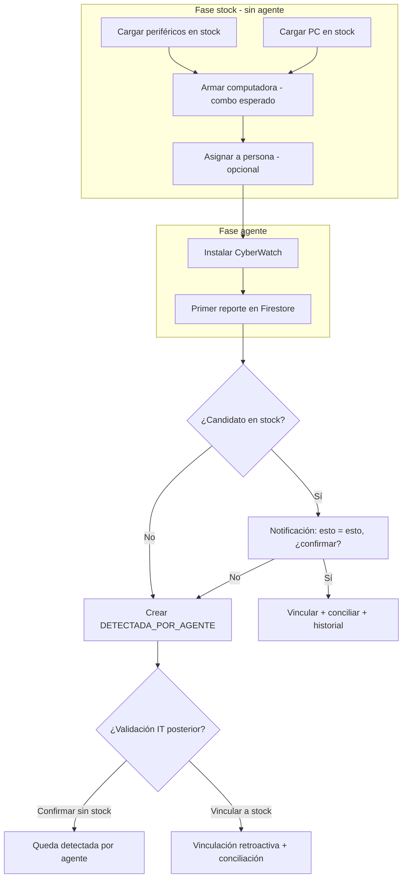

# Trazabilidad stock ↔ agente ↔ asignación

Documento de análisis funcional y técnico para la nueva funcionalidad de conciliación entre inventario en stock y primer reporte del agente CyberWatch.

**Fecha:** 2026-09-04  
**Estado:** Análisis / diseño — pendiente de aprobación e implementación  
**Alcance:** Backend Java (`inventario/`) + Frontend React (`inventario/inventario-front/`)

---

## Objetivo de la funcionalidad

Lograr **trazabilidad completa** del ciclo de vida de una computadora:

1. Alta en stock (con tipo, condición y combo de periféricos).
2. Armado desde ítems ya cargados en stock.
3. Asignación a persona o sector.
4. Primer reporte del agente y **validación automática** contra lo esperado.
5. Historial auditable que permita detectar discrepancias (incluidos cambios de CPU, RAM o periféricos).

Con esto el equipo IT puede:

- Saber qué PCs **estuvieron en stock** antes de operar en producción.
- Confirmar que lo entregado coincide con lo detectado por el agente.
- Detectar upgrades o cambios no autorizados de hardware.
- Vincular retroactivamente equipos creados solo por agente a stock existente cuando el alta manual falló o fue incompleta.

---

## Problema que resuelve

Hoy el flujo operativo separa:

- **Stock de periféricos** (carga manual, combos posibles).
- **Stock de computadoras** (carga manual por otro camino).
- **Datos del agente** (telemetría en Firestore, expuesta vía API).

No existe un puente formal entre **“lo que declaré en stock”** y **“lo que el agente encontró”**. La correlación depende implícitamente de `hostname` o UUID, sin baseline esperado ni estado de conciliación.

Consecuencias actuales:

- Difícil auditar si una PC salió de stock o apareció “de la nada”.
- No hay alerta cuando hardware real difiere del inventario esperado.
- Asignaciones y periféricos no quedan ligados de forma fuerte al UUID de la computadora.
- No se puede detectar de forma sistemática un cambio de CPU “más óptimo” u otro drift de hardware.

---

## Estado actual del sistema

### Backend (Java / Firestore)

| Área | Qué existe | Limitación |
|------|------------|------------|
| `Computadora` | UUID, hostname, hardware snapshot, estados, historial | Sin campos de identidad física fuerte (serial chasis, MAC principal, BIOS UUID) |
| Ciclo de vida | `EstadoOperativo`: `SIN_ASIGNAR`, `ASIGNADA`, etc. | Sin estado de conciliación stock/agente |
| `PerifericoManual` | Stock manual, asignación, combos | Asignación por `computadoraHostname` (string), no por UUID |
| `EventoHardware` | Auditoría de cambios HW (antes/después) | Orientado a revisiones, no a primer check-in vs stock |
| Progreso logístico QR | Historial por fases (etiquetado, embalado) | Dominio separado del inventario operativo |
| Import admin | Cámaras, máquinas tesorería | No hay import/alta masiva de PCs en stock |

**Archivos clave:**

- `inventario/src/main/java/com/bacarsa/inventario/models/Computadora.java`
- `inventario/src/main/java/com/bacarsa/inventario/models/CambioEstado.java`
- `inventario/src/main/java/com/bacarsa/inventario/models/PerifericoManual.java`
- `inventario/src/main/java/com/bacarsa/inventario/models/EventoHardware.java`
- `inventario/src/main/java/com/bacarsa/inventario/repository/ComputadoraRepository.java`
- `inventario/src/main/java/com/bacarsa/inventario/services/PerifericoManualService.java`

### Frontend (React / Vite)

| Área | Qué existe | Limitación |
|------|------------|------------|
| Alta PC | `ComputadoraNueva.jsx` — hostname, SO, ubicación, motivo | Sin `tipoEquipo`, `condicion`, combo al alta |
| Stock manual | `PerifericoManualList.jsx` — PCs y periféricos por separado | Combo no vinculado automáticamente a una PC concreta |
| Detalle PC | Tabs hardware, periféricos, asignación, auditoría | Sin bloque “esperado vs real” ni badge de conciliación |
| Eventos HW | Timeline y bandeja de revisión | No cubre conciliación inicial stock vs agente |
| Catálogos | `CatalogosAdmin.jsx` | Sin catálogos `tipos_equipo` / `condiciones_equipo` |

**Archivos clave:**

- `inventario/inventario-front/src/pages/ComputadoraNueva.jsx`
- `inventario/inventario-front/src/pages/PerifericoManualList.jsx`
- `inventario/inventario-front/src/pages/ComputadoraDetail.jsx`
- `inventario/inventario-front/src/components/ComputadoraEventosTimeline.jsx`
- `inventario/inventario-front/src/pages/EventosHardwareList.jsx`

---

## Flujo operacional objetivo

### Operación real acordada

1. Se cargan **periféricos** en stock (flujo actual).
2. Se cargan **PCs** en stock (flujo actual, ampliado con tipo y condición).
3. **Nuevo paso — Armar computadora:** desde una PC ya en stock, seleccionar monitor, mouse y teclado también en stock → genera un **combo esperado** vinculado al UUID de esa PC.
4. Opcional: **asignar** a persona/sector → estado `ASIGNADA`, historial “asignado a”.
5. Se instala el agente en la máquina física.
6. **Primer reporte del agente** → el sistema busca candidatos en stock y dispara conciliación.

### Dos momentos, dos “fotos”

| Momento | Qué representa | Origen de datos |
|---------|----------------|-----------------|
| **Baseline esperado** | Lo que IT declara al armar/asignar | Alta stock + armado combo + asignación |
| **Snapshot agente** | Lo que la máquina realmente es | Primer (y sucesivos) reportes CyberWatch |

La trazabilidad = comparar baseline vs snapshot + guardar resultado y evidencia.



---

## Decisiones de negocio (acordadas)

### 1. Matching stock ↔ agente

**Opción preferida:** detección automática (A/B) + **notificación para confirmación humana**.

Cuando el score de coincidencia supera umbral mínimo, el sistema muestra:

> “Encontré una coincidencia:  
> **Agente:** `ADMIN-JP-01` — i5-12400, 16 GB, monitor Dell ABC123  
> **Stock:** `PC-STOCK-042` — desktop nueva, combo monitor Dell ABC123  
> **¿Es la misma máquina?**”

Acciones: **Sí, vincular** | **No, es otra** | **Revisar después**

No se asume match silencioso salvo política explícita de auto-vinculación en scores muy altos (opcional, fase posterior).

### 2. Agente reporta sin stock previo

Crear la computadora con origen **`DETECTADA_POR_AGENTE`**.

- Sin baseline de stock.
- Historial: “Alta automática por primer reporte del agente”.
- Visible en listados y filtros como origen distinto.

### 3. Stock mal cargado o inexistente

Si no hubo match inicial, la PC queda como detectada por agente. IT debe poder:

- **Confirmar:** “Nunca estuvo en stock” → queda validada como detectada.
- **Vincular retroactivamente:** buscar PC en stock y ligar → recalcular conciliación, actualizar historial (“vinculada retroactivamente a stock del …”).

---

## Alcance del proyecto

### Dentro de alcance (MVP + evolución)

| Ítem | Descripción |
|------|-------------|
| Campos en alta stock | `tipoEquipo` (mini_pc, desktop, notebook), `condicion` (nueva, usada) |
| Armado de computadora | UI para vincular PC en stock + periféricos en stock (combo esperado) |
| Baseline esperado | Snapshot mínimo al armar/asignar: CPU, RAM, periféricos del combo |
| Conciliación primer reporte | Job/servicio que compare baseline vs snapshot agente |
| Notificaciones / bandeja | Matches sugeridos con confirmación IT |
| Origen de alta | `STOCK`, `DETECTADA_POR_AGENTE`, `DETECTADA_VINCULADA_RETRO` |
| Estados de conciliación | `PENDIENTE`, `COINCIDE`, `DISCREPANCIA`, `SIN_BASELINE` |
| Historial | Eventos en historial de PC: stock, combo, asignación, conciliación |
| Vinculación retroactiva | Desde detalle de PC detectada → buscar y ligar stock |
| Trazabilidad asignado a | Responsable + fechas en historial unificado |

### Fuera de alcance (inicial)

| Ítem | Motivo |
|------|--------|
| Cambios en agente C# CyberWatch | Proyecto separado; usar campos que ya reporta |
| QR obligatorio al instalar agente | Mejora futura (match más confiable) |
| Event-sourcing completo | Fase arquitectónica posterior |
| Import masivo Excel de stock PC | Puede ser iteración aparte |
| Refactor total de `PerifericoManual` | Solo ajustes necesarios (vincular por UUID) |

### Dependencias

- Backend Java expone nuevos campos y endpoints de conciliación.
- Frontend consume APIs y muestra bandeja + detalle esperado vs real.
- Firestore: nuevos campos en documentos `computadoras` (y opcional colección `conciliaciones_stock`).

---

## Requerimientos funcionales

### RF-01 — Alta de PC en stock enriquecida

- Al crear PC en stock, capturar obligatoriamente:
  - `tipoEquipo`: mini_pc | desktop | notebook
  - `condicion`: nueva | usada
  - `ubicacionStock`
  - Datos opcionales de hardware esperado: CPU, RAM total, disco
- Estado inicial: `SIN_ASIGNAR` (o equivalente operativo).
- Registrar en historial: “Alta en stock”.

### RF-02 — Armado de computadora desde stock existente

- Dado una PC en stock (`SIN_ASIGNAR`), permitir seleccionar del stock:
  - 1 monitor (opcional según política)
  - 1 mouse (opcional)
  - 1 teclado (opcional)
- Reservar/marcar periféricos como asociados a esa PC (por UUID, no solo hostname).
- Persistir `comboEsperado` en la PC o entidad relacionada.
- Historial: “Combo armado” con IDs/nombres de periféricos.

### RF-03 — Asignación con trazabilidad

- Al asignar PC a persona/sector:
  - Actualizar estado a `ASIGNADA`.
  - Guardar responsable, fecha, motivo.
  - Refrescar baseline si corresponde (fecha de entrega).
- Historial: “Asignada a {persona/sector}”.

### RF-04 — Detección de candidatos al primer reporte del agente

- Cuando llega primer snapshot con hardware para un UUID/hostname:
  - Buscar PCs en stock o recién asignadas sin conciliar.
  - Calcular score de match (ver sección Matching).
  - Si score ≥ umbral mínimo → crear sugerencia de vinculación.

### RF-05 — Notificación de conciliación

- Mostrar notificación (toast, sidebar o bandeja dedicada):
  - Datos lado agente vs lado stock.
  - Score y campos que coincidieron.
  - Acciones: confirmar, rechazar, posponer.

### RF-06 — Conciliación tras confirmación

- Al confirmar vinculación:
  - Unir snapshot agente al registro de stock (mismo UUID canónico o merge controlado).
  - Comparar baseline vs snapshot campo a campo.
  - Setear `estadoConciliacion`: COINCIDE | DISCREPANCIA.
  - Registrar `scoreConciliacion`, `fechaConciliacion`, usuario IT.
  - Historial: “Validada con stock” o “Discrepancia detectada”.

### RF-07 — Alta detectada por agente

- Si no hay candidato o IT rechaza match:
  - Crear PC con `origenAlta = DETECTADA_POR_AGENTE`.
  - `estadoConciliacion = SIN_BASELINE`.
  - Historial automático de creación.

### RF-08 — Vinculación retroactiva

- En detalle de PC detectada por agente:
  - Buscar PCs en stock (manual o sugeridas).
  - Vincular → recalcular conciliación.
  - Actualizar origen a `DETECTADA_VINCULADA_RETRO`.
  - Historial de vinculación retroactiva.

### RF-09 — Visualización esperado vs real

- En detalle de computadora, bloque comparativo:
  - Columna “Esperado (stock)” vs “Real (agente)”.
  - Resaltar diferencias (CPU, RAM, monitor, etc.).
  - Badge de estado de conciliación.

### RF-10 — Bandeja de pendientes

- Listar:
  - Sugerencias de match pendientes de confirmación.
  - PCs en stock sin reporte de agente (tiempo en stock).
  - Detectadas por agente sin validar.

### RF-11 — Discrepancias y resolución IT

- Ante DISCREPANCIA:
  - Permitir notas IT: autorizado / no autorizado / falso positivo.
  - Opcional: crear o enlazar `EventoHardware` existente.
  - Cerrar con trazabilidad (quién, cuándo, decisión).

### RF-12 — Catálogos

- Agregar catálogos administrables (o enums inicialmente):
  - `tipos_equipo`
  - `condiciones_equipo`

---

## Requerimientos no funcionales

| ID | Requerimiento |
|----|----------------|
| RNF-01 | Compatibilidad con PCs existentes sin baseline — ver [Migración de PCs existentes](#migración-de-pcs-existentes) |
| RNF-02 | Historial append-only de conciliaciones (no sobrescribir decisiones previas) |
| RNF-03 | Vinculaciones por UUID de computadora, no solo hostname |
| RNF-04 | Operaciones de conciliación idempotentes — ver [Resiliencia del job de matching](#resiliencia-del-job-de-matching) |
| RNF-05 | Auditoría: usuario y timestamp en confirmaciones y vinculaciones retroactivas |
| RNF-06 | Performance: matching en batch o async para no bloquear API de listados |
| RNF-07 | Índices Firestore definidos y desplegados antes de activar matching en producción |
| RNF-08 | Normalización de hardware antes de comparar (RAM, CPU, seriales genéricos) |
| RNF-09 | Job de matching con retry y reprocesamiento ante fallos o encolado tardío |

---

## Modelo de datos propuesto (mínimo)

### Campos nuevos en `Computadora`

```text
tipo_equipo              : mini_pc | desktop | notebook
condicion                : nueva | usada
origen_alta              : STOCK | DETECTADA_POR_AGENTE | DETECTADA_VINCULADA_RETRO | LEGACY
estado_conciliacion      : PENDIENTE | COINCIDE | DISCREPANCIA | SIN_BASELINE | NO_APLICA | BASELINE_LISTO
score_conciliacion       : number (0-100)
fecha_conciliacion       : timestamp
primer_reporte_agente_at : timestamp
matching_job_estado      : MATCHING_PENDIENTE | MATCHING_EN_PROCESO | MATCHING_OK | MATCHING_ERROR

# Identidad fuerte (capturar cuando estén disponibles)
asset_tag                : string
serial_equipo            : string
motherboard_serial       : string
bios_uuid                : string
mac_principal            : string

# Baseline esperado (objeto embebido o subdocumento)
baseline_esperado        : {
  cpu_modelo, ram_total_gb, disco_resumen,
  perifericos: [{ tipo, id_stock, marca, modelo, numero_serie }]
}

# Combo vinculado
combo_esperado_id        : string (opcional, referencia lógica)
```

### Colección opcional `conciliaciones_stock` (recomendada)

Registro append-only por intento de match:

```text
id, computadora_uuid, candidato_stock_uuid,
score, campos_coincidentes[], campos_diferentes[],
decision: PENDIENTE | CONFIRMADA | RECHAZADA,
usuario, fecha, origen: PRIMER_REPORTE | RETROACTIVA
```

### Estados operativos extendidos

| Estado / flag | Significado |
|---------------|-------------|
| `SIN_ASIGNAR` | En stock, sin asignar |
| `ASIGNADA` | Entregada a usuario/sector |
| `PENDIENTE_VINCULACION` | Agente reportó, hay candidato, falta confirmar |
| `VINCULADA_STOCK` | Confirmado: es la PC de stock |
| Origen `DETECTADA_POR_AGENTE` | Solo agente, sin stock previo |
| Origen `DETECTADA_VINCULADA_RETRO` | Detectada, luego ligada a stock |
| Origen `LEGACY` | PC pre-trazabilidad; excluida de matching automático |
| `NO_APLICA` | Legacy sin conciliación; no aparece en bandeja por defecto |
| `BASELINE_LISTO` | Armada en stock con combo/baseline; pendiente primer reporte agente |

---

## Estrategia de matching (score)

| Campo | Peso sugerido | Notas |
|-------|---------------|-------|
| Serial equipo / asset tag | +50 | Match fuerte si ambos lados lo tienen |
| Motherboard serial / BIOS UUID | +30 | Estable ante cambio de hostname |
| MAC principal | +20 | Identidad de red |
| Modelo CPU | +15 | Normalizar strings (i5-12400 vs Intel Core i5-12400) |
| RAM total (GB) | +10 | Ver [tolerancia RAM](#tolerancia-en-matching-de-ram) |
| Serial monitor (combo) | +10 | Ver [match de periféricos](#match-de-periféricos-monitores-y-combo) |
| Marca/modelo monitor (fallback) | +5 | Solo si serial ausente o genérico |

**Umbrales:**

| Score | Acción |
|-------|--------|
| ≥ 70 | Sugerir match con alta confianza → notificación |
| 40–69 | Sugerir revisión manual |
| < 40 | No sugerir; crear `DETECTADA_POR_AGENTE` |

**Reglas adicionales:**

- Hostname solo no debe ser criterio principal (cambia con frecuencia).
- Si hay empate de candidatos, mostrar lista ordenada por score.
- QR/etiqueta en fase futura puede forzar match (+100).

### Tolerancia en matching de RAM

Los sistemas operativos y el agente suelen reportar valores **ligeramente menores** al nominal de fábrica. No tratar `15.8 GB` vs `16 GB` como discrepancia ni penalizar el score.

**Reglas propuestas:**

1. **Normalizar antes de comparar:** convertir ambos lados a GB con decimales (no enteros truncados).
2. **Tolerancia relativa:** considerar match si `|esperado - real| / esperado ≤ 5%`.
3. **Tolerancia absoluta mínima:** además, aceptar diferencia ≤ `0.5 GB` aunque supere el 5% en equipos chicos (ej. 3.8 vs 4 GB).
4. **Buckets nominales:** opcionalmente mapear a valores estándar antes de comparar:

   | Reportado (GB) | Bucket nominal |
   |----------------|----------------|
   | 3.5 – 4.5      | 4              |
   | 7.0 – 9.0      | 8              |
   | 14.5 – 17.5    | 16             |
   | 30.0 – 34.0    | 32             |

5. **Conciliación vs score:** en score sumar puntos si hay match tolerado; en pantalla “esperado vs real” mostrar ambos valores con nota *“dentro de tolerancia OS”* cuando aplique.
6. **Discrepancia real:** solo marcar `DISCREPANCIA` en RAM si la diferencia supera tolerancia **y** no cae en el mismo bucket nominal (ej. stock 8 GB, agente 16 GB).

**Ejemplos:**

| Stock | Agente | Resultado matching |
|-------|--------|--------------------|
| 16 GB | 15.8 GB | Match (+10) |
| 16 GB | 15.4 GB | Match por bucket (+10) |
| 8 GB  | 16 GB   | No match; posible upgrade → discrepancia |
| 4 GB  | 3.7 GB  | Match (+10) |

### Match de periféricos (monitores y combo)

La lectura de **número de serie** de monitores vía agente es poco confiable: a veces falla, viene vacía o es genérica (`00000000`, `SN123456`, `Default string`, etc.).

**Estrategia en cascada para cada periférico del combo:**

| Prioridad | Criterio | Peso | Condición |
|-----------|----------|------|-----------|
| 1 | Serial exacto (normalizado) | +10 | Ambos seriales válidos y no genéricos |
| 2 | Marca + modelo | +5 | Serial ausente/genérico en agente o stock |
| 3 | Solo tipo presente | +2 | Monitor detectado pero sin datos útiles |

**Serial genérico / inválido — tratar como ausente si cumple alguna:**

- Vacío, null, `N/A`, `Unknown`, `Default string`
- Solo ceros o caracteres repetidos (`00000000`, `XXXXXXXX`)
- Longitud menor a umbral configurable (ej. &lt; 4 caracteres alfanuméricos útiles)
- Lista configurable de placeholders conocidos por marca/driver

**Normalización de marca/modelo:**

- Minúsculas, trim, quitar prefijos redundantes (`DELL`, `LG Electronics` → `lg`)
- Comparación fuzzy opcional en fase 2 (Levenshtein o contains) para variantes (`U2419H` vs `DELL U2419H`)

**En UI de conciliación:** indicar explícitamente *“Match por marca/modelo (serial no disponible en agente)”* para que IT valide con contexto.

### Índices Firestore para matching asíncrono

El servicio de matching correrá **asíncrono** (no en el request del listado). Para buscar candidatos en stock sin degradar performance, hace falta definir índices compuestos antes de producción.

**Consultas típicas del matcher:**

1. PCs en stock pendientes de conciliar:
   - `origen_alta == STOCK` AND `estado_conciliacion IN (PENDIENTE, SIN_BASELINE)` AND `estado_actual.nombre IN (SIN_ASIGNAR, ASIGNADA)`
2. Candidatos por hardware esperado (pre-filtro):
   - `baseline_esperado.cpu_modelo` + `tipo_equipo` + `condicion`
3. Sugerencias pendientes de confirmación:
   - `conciliaciones_stock.decision == PENDIENTE` ORDER BY `fecha` DESC
4. PCs detectadas sin validar:
   - `origen_alta == DETECTADA_POR_AGENTE` AND `estado_conciliacion == SIN_BASELINE`

**Índices compuestos sugeridos (colección `computadoras`):**

```text
# Candidatos stock pendientes
- origen_alta ASC, estado_conciliacion ASC, estado_actual.nombre ASC

# Filtro listado bandeja IT
- estado_conciliacion ASC, primer_reporte_agente_at DESC

# Stock sin agente (alertas tiempo en stock)
- origen_alta ASC, estado_conciliacion ASC, ultima_sincronizacion ASC
```

**Índices sugeridos (colección `conciliaciones_stock`):**

```text
- decision ASC, fecha DESC
- computadora_uuid ASC, fecha DESC
- candidato_stock_uuid ASC, decision ASC
```

**Buenas prácticas:**

- Limitar candidatos con filtros de estado antes de calcular score en memoria (no escanear toda la colección).
- Paginar bandeja de sugerencias; no traer todos los documentos en cada ciclo.
- Cachear catálogos y lista acotada de PCs `SIN_ASIGNAR` / `ASIGNADA` recientes (ventana temporal, ej. últimos 90 días).
- Registrar en `firestore.indexes.json` del proyecto y desplegar índices **antes** de Fase 2.
- Monitorear queries lentas; Firestore console → agregar índices según errores `FAILED_PRECONDITION`.

**Implementación backend:**

- Job async (Spring `@Async`, cola, o trigger post-sync) dispara matching al detectar `primer_reporte_agente_at` nuevo.
- El endpoint REST de listados **no** ejecuta matching; solo lee estado ya calculado.

Ver también: [Resiliencia del job de matching](#resiliencia-del-job-de-matching).

### Resiliencia del job de matching

El matching asíncrono puede fallar, encolarse tarde o reprocesarse por un redeploy. Hay que diseñarlo **idempotente** desde el inicio (RNF-04, RNF-09).

**Clave de idempotencia:**

- Identificar cada intento por `(computadora_uuid, snapshot_version | ultima_sincronizacion | hash_hardware)`.
- Antes de crear sugerencia en `conciliaciones_stock`, verificar si ya existe una con misma clave y `decision != RECHAZADA`.
- Reprocesar el mismo snapshot no debe duplicar notificaciones ni incrementar contadores.

**Estados del job (por PC):**

| Estado | Significado |
|--------|-------------|
| `MATCHING_PENDIENTE` | Detectado primer reporte, job aún no corrió |
| `MATCHING_EN_PROCESO` | Job en ejecución (evita doble dispatch) |
| `MATCHING_OK` | Sugerencia creada o descartada sin candidatos |
| `MATCHING_ERROR` | Falló; pendiente de retry |

**Retry:**

- Reintentos con backoff exponencial (ej. 1 min, 5 min, 30 min, 2 h).
- Máximo N intentos (ej. 5); luego marcar `MATCHING_ERROR` y alertar en bandeja IT.
- Job de recuperación periódico (cron cada 15–30 min) que reencola PCs en `MATCHING_PENDIENTE` o `MATCHING_ERROR` con antigüedad > umbral.

**Encolado tardío:**

- Si el agente reportó hace días pero el job no corrió (deploy, caída), el cron de recuperación lo detecta por `primer_reporte_agente_at` presente + `estado_conciliacion == SIN_BASELINE` + sin sugerencia en `conciliaciones_stock`.
- Endpoint admin opcional: `POST /api/admin/conciliaciones/reprocesar/{uuid}` para forzar re-run manual.

**Fallos parciales:**

- Si el matching calcula score pero falla al persistir sugerencia → no marcar `MATCHING_OK`; dejar en `MATCHING_ERROR` para retry.
- Transacción o patrón outbox: escribir sugerencia y actualizar flag de PC de forma atómica cuando sea posible.

**Observabilidad:**

- Log estructurado: uuid, score, candidatos evaluados, duración, intento N.
- Métrica: jobs fallidos / reintentados / reprocesados manualmente.

---

## Ejemplos de escenarios

### Escenario A — Flujo feliz

1. Stock: desktop nueva, i5-12400, 16 GB, combo monitor Dell `ABC123`.
2. Asignada a Juan Pérez.
3. Agente reporta mismos datos + hostname `ADMIN-JP-01`.
4. Notificación → IT confirma.
5. Resultado: `COINCIDE`, historial completo stock → asignación → validación.

### Escenario B — RAM dentro de tolerancia (no es discrepancia)

1. Stock: 16 GB RAM.
2. Agente: 15.8 GB RAM (reporte OS habitual).
3. Match de RAM suma puntos; UI muestra *“dentro de tolerancia OS”*.
4. No genera discrepancia ni ticket IT.

### Escenario C — Discrepancia (upgrade RAM real)

1. Stock: 8 GB RAM.
2. Agente: 16 GB RAM.
3. IT confirma vinculación → `DISCREPANCIA` en RAM.
4. Nota: “Upgrade autorizado pre-entrega”.

### Escenario D — Monitor sin serial confiable

1. Stock: combo con monitor Dell U2419H, serial `ABC123`.
2. Agente: monitor Dell U2419H, serial `00000000`.
3. Match parcial por marca/modelo (+5); serial no suma.
4. Notificación indica: *“Monitor: match por modelo (serial agente genérico)”*.

### Escenario E — Cambio de CPU detectado

1. Stock: i3-10100.
2. Agente: i5-12400.
3. Discrepancia CPU → bandeja IT → decidir si fue optimización legítima.

### Escenario F — Sin stock previo

1. Agente reporta PC nueva en red.
2. Sin candidatos → `DETECTADA_POR_AGENTE`.
3. IT confirma o vincula retroactivamente si encuentra stock omitido.

### Escenario G — Stock mal cargado

1. PC nunca se dio de alta en stock (o datos incorrectos).
2. Agente crea detectada por agente.
3. IT encuentra `PC-STOCK-042` → vinculación retroactiva → conciliación muestra diferencias.

---

## Propuesta de implementación por fases

> **Tradeoff ambición vs velocidad:** la Fase 1 original agrupaba demasiado (campos, catálogos, baseline, UI de armado, badge). Se parte en **1a** y **1b** para entregar valor antes y validar el modelo de datos con PCs reales antes de construir el matching.

### Fase 1a — Campos y catálogos en alta (P0)

**Alcance acotado — entrega rápida:**

- Backend: campos `tipoEquipo`, `condicion`, `origenAlta` en modelo/DTO/mapper.
- Catálogos `tipos_equipo` y `condiciones_equipo` (enums o catálogo admin).
- UI: selects en `ComputadoraNueva` y modal de alta PC en stock.
- **Migración one-shot** de PCs existentes (ver sección dedicada).
- Listados: mostrar tipo/condición; filtros excluyen legacy ruidoso por defecto.

**Entregable:** PCs nuevas se cargan con tipo y condición; legacy migrado con defaults; sin romper listados.

**No incluye:** armado de combo, baseline, badge de conciliación, matching.

---

### Fase 1b — Armado de combo + baseline (P0)

**Depende de 1a:**

- UI **“Armar computadora”**: desde PC en stock, seleccionar monitor/mouse/teclado del stock ya cargado.
- Vincular periféricos por `computadoraUuid` (refactor mínimo de asignación).
- Persistir `baseline_esperado` y `combo_esperado_id` al confirmar armado.
- Badge básico en detalle: `SIN_BASELINE` (sin agente) / `BASELINE_LISTO` (armada, pendiente agente).

**Entregable:** Flujo stock → armado combo → baseline listo para conciliación futura.

**Validación intermedia:** pilotear con lote pequeño de PCs reales antes de Fase 2. Guía operativa: [`piloto-fase1b.md`](./piloto-fase1b.md).

**Plan de implementación Fase 2:** [`iteracion-fase2-pasos.md`](./iteracion-fase2-pasos.md).

---

### Fase 2 — Conciliación (P0)

> Plan detallado: [`iteracion-fase2-pasos.md`](./iteracion-fase2-pasos.md)

- Servicio de matching **asíncrono** al detectar primer reporte.
- Lógica de tolerancia RAM y match parcial periféricos (marca/modelo).
- **Resiliencia del job:** idempotencia, retry, cron de recuperación (ver sección dedicada).
- Índices Firestore definidos y desplegados (`firestore.indexes.json`).
- Colección o log de sugerencias.
- Bandeja “Conciliaciones pendientes” + notificación.
- Confirmación → actualizar estado e historial.

**Entregable:** Flujo notificación “¿esto = esto?” operativo, sin impacto en performance de listados.

### Fase 3 — Detectada y retroactiva (P1)

- Alta automática `DETECTADA_POR_AGENTE`.
- Pantalla vinculación retroactiva.
- Bloque esperado vs real en detalle.

**Entregable:** Cierre del ciclo cuando stock falló o no existió.

### Fase 4 — Discrepancias e insights (P1/P2)

- Workflow resolución discrepancias (notas, enlace eventos HW).
- KPIs: % validadas, discrepancias abiertas, tiempo stock → agente.
- Alertas: PC en stock > N días sin agente.

**Entregable:** Detección proactiva de cambios de CPU y drift de hardware.

---

## Migración de PCs existentes

RNF-01 no alcanza con “no romper listados”: hay que definir **valores default explícitos** y una estrategia de migración para evitar ruido en bandejas y filtros desde el día 1.

### Valores default para documentos legacy (sin campos nuevos)

| Campo | Valor default | Visible en UI |
|-------|---------------|---------------|
| `origen_alta` | `LEGACY` (enum nuevo) | Sí — badge “Legacy / pre-trazabilidad” |
| `estado_conciliacion` | `NO_APLICA` (enum nuevo) | No aparece en bandeja de conciliación |
| `tipo_equipo` | `null` o inferido si existe dato | Opcional: inferir notebook vs desktop por heurística existente |
| `condicion` | `null` | Editable manualmente si IT completa datos |
| `baseline_esperado` | `null` | — |
| `primer_reporte_agente_at` | Inferir de `ultima_sincronizacion` si agente ya reportó | Solo lectura |

**Enums extendidos:**

```text
origen_alta: STOCK | DETECTADA_POR_AGENTE | DETECTADA_VINCULADA_RETRO | LEGACY
estado_conciliacion: PENDIENTE | COINCIDE | DISCREPANCIA | SIN_BASELINE | NO_APLICA | BASELINE_LISTO
```

`NO_APLICA` = PC anterior al feature; **excluida** de bandeja de conciliación y matching automático.  
`LEGACY` = no pasó por flujo stock; no generar sugerencias de match salvo acción manual IT.

### Script de migración (one-shot)

Ejecutar **antes o junto con Fase 1a** (endpoint admin o job batch):

```
POST /api/admin/migracion/trazabilidad-stock-v1
```

**Lógica por documento en `computadoras`:**

1. Si ya tiene `origen_alta` → skip (idempotente).
2. Si `ultima_sincronizacion` presente → `origen_alta = LEGACY`, `estado_conciliacion = NO_APLICA`, opcionalmente setear `primer_reporte_agente_at = ultima_sincronizacion` (aproximación).
3. Si sin sync y estado `SIN_ASIGNAR` → `origen_alta = STOCK`, `estado_conciliacion = SIN_BASELINE` (no `PENDIENTE`). No entran al matcher automático hasta que IT complete baseline manualmente.
4. Resto → `LEGACY` + `NO_APLICA`.
5. No tocar `historialEstados` existente; opcional entrada: “Migración trazabilidad v1 — valores default aplicados”.

**Idempotencia:** re-ejecutar migración no sobrescribe campos ya seteados por operación normal.

### Filtros de bandeja (evitar ruido día 1)

| Vista | Filtro por defecto |
|-------|-------------------|
| Conciliaciones pendientes | `estado_conciliacion IN (PENDIENTE)` AND `origen_alta != LEGACY` |
| Detectadas sin validar | `origen_alta == DETECTADA_POR_AGENTE` |
| Stock sin agente | `origen_alta == STOCK` AND `estado_conciliacion IN (SIN_BASELINE, BASELINE_LISTO)` |
| Todas las PCs | Incluye legacy; badge visible |

Toggle en UI: “Incluir equipos legacy (pre-trazabilidad)” para auditoría ocasional.

### PCs legacy que IT quiera incorporar al flujo

- Acción manual: “Completar datos de stock” → setear tipo, condición, opcional baseline → `origen_alta = STOCK`, `estado_conciliacion = BASELINE_LISTO` o `SIN_BASELINE`.
- No disparar matching automático salvo que IT lo solicite o haya nuevo reporte agente post-migración.

---

## Riesgos y mitigaciones

| Riesgo | Mitigación |
|--------|------------|
| Falsos positivos en match | Confirmación humana; no auto-vincular en MVP |
| Hostname como única clave | Score multi-campo; migrar asignaciones a UUID |
| Datos agente incompletos | Baseline parcial; pesos ajustables; campos opcionales |
| Duplicación UUID al vincular | Reglas de merge documentadas; una PC canónica |
| PCs legacy sin baseline | Estado `SIN_BASELINE`; no forzar conciliación |
| Periféricos asignados por hostname | Refactor gradual a `computadoraUuid` |
| RAM reportada menor al nominal | Tolerancia 5% + buckets; no marcar discrepancia falsa |
| Serial monitor genérico en agente | Match parcial marca/modelo; mostrar contexto en UI |
| Queries Firestore lentas en matching | Índices compuestos + job async + ventana temporal de candidatos |
| Fase 1 demasiado amplia retrasa valor | Partir en 1a (campos) + 1b (combo/baseline); pilotear antes de Fase 2 |
| Ruido en bandejas por PCs legacy | Migración con `LEGACY` + `NO_APLICA`; filtros excluyen legacy por defecto |
| Job matching falla o se encola tarde | Idempotencia, retry con backoff, cron recuperación, reproceso admin |
| Ambición vs velocidad de entrega | Entregas incrementales; validar modelo con PCs reales en 1b antes de matching |

---

## Métricas de éxito

| Métrica | Objetivo orientativo |
|---------|----------------------|
| % PCs con historial stock → agente | Aumentar en equipos nuevos al 100% |
| Tiempo medio stock → validación agente | Medible y visible en dashboard |
| % conciliaciones confirmadas vs rechazadas | Calibrar umbrales de score |
| Discrepancias detectadas y resueltas | Trazabilidad completa con nota IT |
| PCs detectadas sin stock | Reducir con mejor proceso de alta |

---

## Criterios de aceptación (resumen)

- [ ] Puedo cargar PC en stock con tipo y condición.
- [ ] Puedo armar computadora eligiendo periféricos ya en stock.
- [ ] Al primer reporte del agente, recibo notificación si hay candidato en stock.
- [ ] Puedo confirmar o rechazar la vinculación.
- [ ] Si no hay stock, se crea PC como detectada por agente.
- [ ] Puedo vincular retroactivamente una detectada a stock existente.
- [ ] El detalle muestra esperado vs real y estado de conciliación.
- [ ] El historial refleja: stock, combo, asignación, conciliación.
- [ ] Las discrepancias (CPU, RAM, periféricos) quedan registradas y resolvibles.
- [ ] RAM 15.8 GB vs stock 16 GB no genera discrepancia (tolerancia OS).
- [ ] Monitor con serial genérico en agente puede matchear por marca/modelo con aviso en UI.
- [ ] Matching async no degrada listados; índices Firestore desplegados.
- [ ] Migración legacy aplicada; bandejas no muestran ruido de PCs pre-trazabilidad por defecto.
- [ ] Reprocesar mismo snapshot de agente no duplica sugerencias (idempotencia).
- [ ] Job fallido reintenta y aparece en bandeja tras agotar reintentos.

---

## Referencias internas

- Diseño general: `README.md`
- Modelo de dominio: `inventario/diagrama-clases.puml`
- Pendientes trazabilidad (#3): `inventario/docs/pendientes.md`
- Fase 1a (implementación): [`iteracion-fase1a-pasos.md`](./iteracion-fase1a-pasos.md)
- Fase 1b (implementación): [`iteracion-fase1b-pasos.md`](./iteracion-fase1b-pasos.md)
- Piloto Fase 1b (validación E2E): [`piloto-fase1b.md`](./piloto-fase1b.md)
- Fase 2 (matching + bandeja): [`iteracion-fase2-pasos.md`](./iteracion-fase2-pasos.md)
- Frontend activo: `inventario/inventario-front/src/`
- Backend: `inventario/src/main/java/com/bacarsa/inventario/`

---

## Próximos pasos sugeridos

1. Revisión y aprobación explícita de este documento (regla operativa del proyecto).
2. Definir iteración en `docs/iteracion-N-pasos.md` con **Fase 1a** desglosada (campos + migración).
3. Acordar nombres finales de campos Firestore y enums (`LEGACY`, `NO_APLICA`, `BASELINE_LISTO`).
4. Ejecutar script de migración legacy junto con deploy de Fase 1a.
5. Pilotear Fase 1b (armado combo) con lote pequeño antes de Fase 2 — ver [`piloto-fase1b.md`](./piloto-fase1b.md).
6. Definir y desplegar índices Firestore + job resilient (previo a Fase 2) — ver [`iteracion-fase2-pasos.md`](./iteracion-fase2-pasos.md).
7. Implementar Fase 2 (matching) solo tras validar baseline real en producción piloto.
